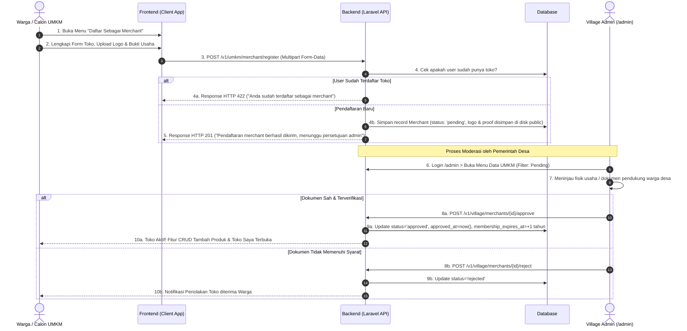
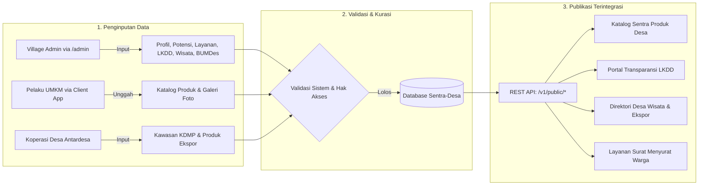
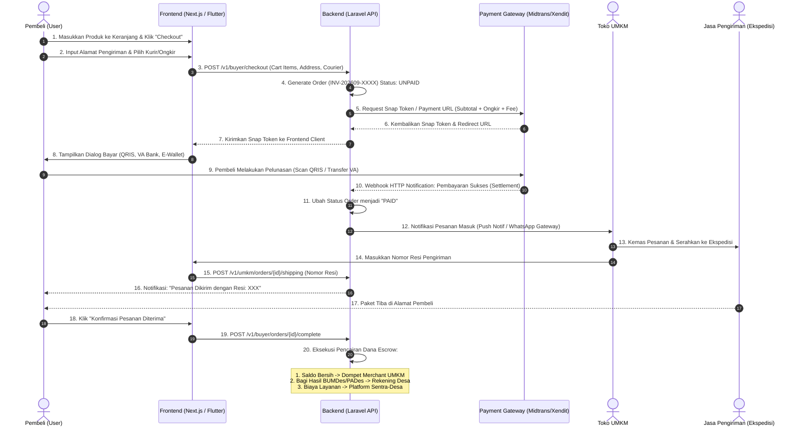
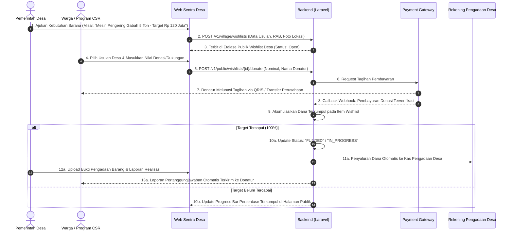
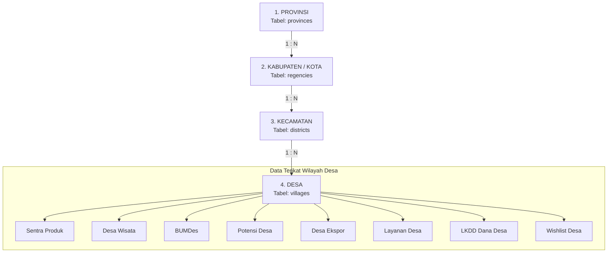

# 📐 Diagram Arsitektur & Alur Bisnis Sistem - Sentra-Desa.id

Dokumen ini memuat dokumentasi visual dan teknis seluruh alur bisnis platform **Sentra-Desa.id**, mencakup hak akses 4 peran pengguna (*Superadmin, Village Admin, UMKM, User/Buyer*), alur autentikasi, siklus pengelolaan 11 modul desa, hingga sistem pembayaran *Payment Gateway (Escrow)*.

Seluruh diagram di bawah ini telah diselaraskan dan tervalidasi dengan implementasi kode pada repositori `sentra-desa-backend` (Laravel 12, Filament v3, dan Laravel Sanctum).

---

## 📑 Daftar Isi Diagram

1. [Diagram 1: Alur Akses Sistem & Autentikasi (4 Peran)](#1-diagram-1-alur-akses-sistem--autentikasi-4-peran)
2. [Diagram 2: Alur Onboarding & Verifikasi Merchant UMKM](#2-diagram-2-alur-onboarding--verifikasi-merchant-umkm)
3. [Diagram 3: Matriks & Siklus Pengelolaan 11 Modul Fitur Desa](#3-diagram-3-matriks--siklus-pengelolaan-11-modul-fitur-desa)
4. [Diagram 4: Alur Transaksi E-Commerce & Payment Gateway (Escrow)](#4-diagram-4-alur-transaksi-e-commerce--payment-gateway-escrow)
5. [Diagram 5: Alur Crowdfunding Wishlist Desa & CSR Perusahaan](#5-diagram-5-alur-crowdfunding-wishlist-desa--csr-perusahaan)
6. [Diagram 6: Arsitektur Geospatial & Cascading Wilayah](#6-diagram-6-arsitektur-geospatial--cascading-wilayah)

---

## 1. Diagram 1: Alur Akses Sistem & Autentikasi (4 Peran)

Sistem memisahkan akses secara tegas menjadi dua pintu masuk:
- **Pintu 1 - Web Backoffice (`/admin`)**: Filament Admin Panel berbasis Session Web khusus aparatur pemerintah.
- **Pintu 2 - Client Apps (Mobile/Web)**: Aplikasi Warga & Pelaku Usaha berbasis REST API dengan Laravel Sanctum Token.


### 🔍 Validasi Teknis Backend:
| Titik Alur | Handler Backend | Logika Validasi |
| :--- | :--- | :--- |
| **Cek Hak Akses Admin** | `User::canAccessPanel(Panel $panel)` | Membatasi hanya `superadmin`, `province_admin`, `regency_admin`, dan `village_admin`. User biasa/UMKM memicu respon **403 Forbidden**. |
| **Isolasi Data Desa** | `getEloquentQuery()` di Resource Filament | Jika `user_level === 'village_admin'`, query otomatis difilter dengan `where('village_id', $user->village_id)`. |
| **Single-Session** | `AuthController@login` | `$user->tokens()->delete()` dijalankan sebelum menerbitkan token baru. Sesi di perangkat lain langsung terputus. |
| **Proteksi Produk UMKM** | `ProductController@store` | Memvalidasi `if (!$merchant || $merchant->status !== 'approved') return 403;`. |

---

## 2. Diagram 2: Alur Onboarding & Verifikasi Merchant UMKM

Alur transformasi dari akun warga biasa menjadi pedagang resmi terverifikasi:



---

## 3. Diagram 3: Matriks & Siklus Pengelolaan 11 Modul Fitur Desa

### Matriks Tanggung Jawab Data (RACI):
| No | Modul Fitur | Creator / Input | Validator / Approval | Konsumen Publik |
| :---: | :--- | :--- | :--- | :--- |
| **1** | **Profil Desa** | `village_admin` | `superadmin` | Warga, Publik, Wisatawan |
| **2** | **Potensi Desa** | `village_admin` | `superadmin` | Calon Investor, Industri |
| **3** | **Informasi / Layanan** | `village_admin` | Langsung Publish | Warga Desa Lokal |
| **4** | **Sentra Produk** | `umkm` (Merchant) | `village_admin` | Konsumen se-Indonesia |
| **5** | **Desa Ekspor** | `umkm` / Koperasi | `village_admin` / Pusat | Buyer Pasar Internasional |
| **6** | **Desa Wisata** | Pokdarwis / Desa | `village_admin` | Wisatawan Domestik & Mancanegara |
| **7** | **BUMDES** | Direktur BUMDes | `village_admin` | Mitra B2B, Pemda, Warga |
| **8** | **KDMP (Pangan)** | Admin Kecamatan/Kab | `superadmin` | Badan Pangan, Mitra Offtaker |
| **9** | **LKDD (Keuangan)** | Bendahara Desa | BPD / Superadmin | Warga (Transparansi Realisasi) |
| **10** | **Artikel Desa** | Perangkat / Kontributor | `village_admin` | Pembaca Umum & Warga |
| **11** | **Wishlist Desa** | Pemerintah Desa | `village_admin` | Donatur, Filantropi, CSR Perusahaan |

### Siklus Alur Data:


---

## 4. Diagram 4: Alur Transaksi E-Commerce & Payment Gateway (Escrow)

Arsitektur sistem pembayaran digital menggunakan rekening penampung aman (*Escrow*), terintegrasi dengan Payment Gateway (Midtrans / Xendit):



---

## 5. Diagram 5: Alur Crowdfunding Wishlist Desa & CSR Perusahaan

Alur penggalangan dukungan dan pembiayaan sarana/prasarana fisik desa:



---

## 6. Diagram 6: Arsitektur Geospatial & Cascading Wilayah

Struktur data wilayah nasional hierarkis 4 tingkat yang digunakan untuk memfilter seluruh katalog, desa wisata, potensi, hingga produk UMKM:



### Format Query API Cascading:
```http
GET /api/v1/public/products?province_id=32&regency_id=3204&district_id=320405&village_id=3204052001
```
*Backend menjalankan kueri relasional `whereHas` bertingkat untuk menyaring data secara instan dan akurat.*
