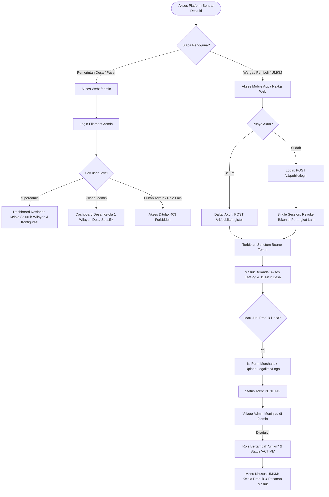
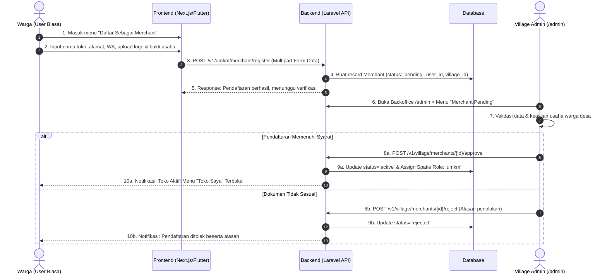
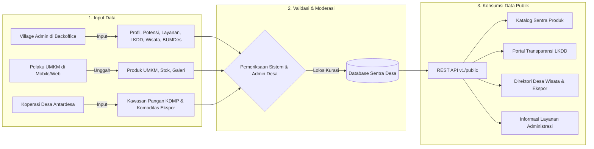
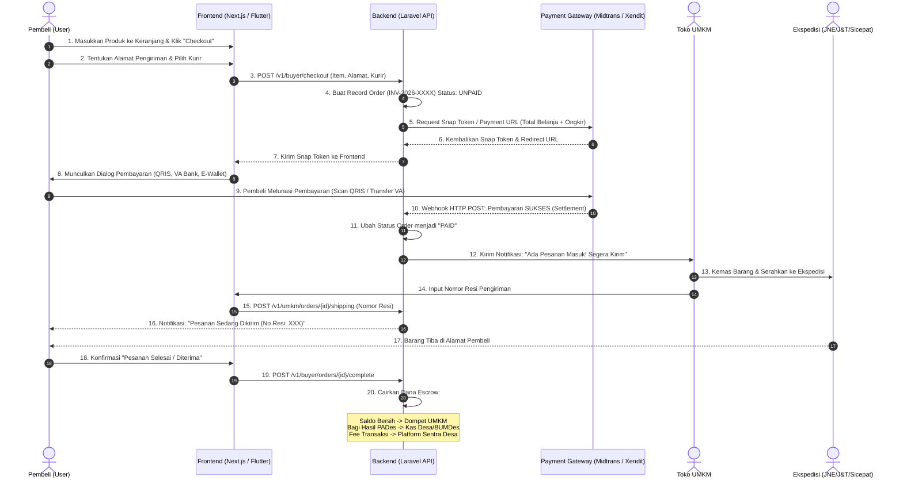
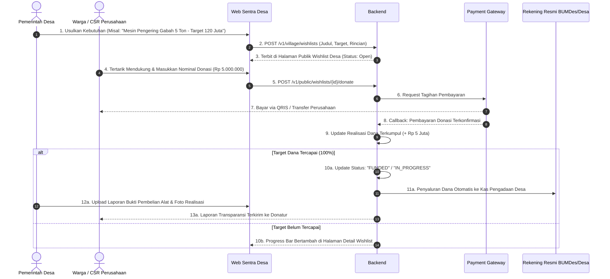

# 📊 Laporan Progres Pengembangan Backend - Sentra-Desa.id

Dokumen ini menyajikan audit menyeluruh, status kesiapan sistem backend (`sentra-desa-backend`) berbasis **Laravel 12**, **Filament v3**, dan **Laravel Sanctum**, serta **Diagram Alur Bisnis (Business Flow Diagrams)** interaktif.

*Terakhir Diperbarui: 17 September 2026*

---

## 🎯 Ringkasan Eksekutif

| Indikator | Capaian | Status |
| :--- | :---: | :--- |
| **Total Progres Backend** | **~72%** | **Fase MVP & Portal Publik Siap Integrasi** |
| **Database & Models** | 90% | Sangat Matang (33 Migrations, 19 Models) |
| **Filament Admin Panel** | 85% | Backoffice Lengkap (20 Resources Aktif) |
| **Public REST API** | 95% | Siap Konsumsi Frontend / Mobile |
| **Merchant & Village API** | 80% | CRUD Produk & Approval Berfungsi |
| **Buyer & Checkout Engine** | 10% | Menunggu Implementasi Transaksi & Payment Gateway |
| **Security & Deployment** | 85% | Sanctum, Single-Session, CORS, Docker CI/CD |
| **Automated Testing** | 10% | Perlu Penambahan Feature & Unit Tests |

---

## 📋 Status Capaian Per Komponen

```
[██████████████████████████████████░░░░░░░░░░░░] 72% Selesai
```

---

## 🔄 Arsitektur & Diagram Alur Bisnis (Business Flow Diagrams)

Bagian ini memvisualisasikan bagaimana 4 peran pengguna (*Superadmin, Village Admin, UMKM, User/Buyer*) berinteraksi dengan sistem, alur pengelolaan 11 modul desa, hingga alur transaksi *Payment Gateway*.

---

### 1. Diagram Alur Akses Sistem & Autentikasi (4 Peran)

Sistem memisahkan akses menjadi **Dua Pintu Utama**:
1. **Web Backoffice (`/admin`)**: Dikelola lewat **Filament Panel** khusus level administrator.
2. **Mobile & Web Publik (`Frontend`)**: Berjalan di atas **REST API + Sanctum Token** untuk Warga dan Pelaku Usaha.



---

### 2. Diagram Alur Onboarding & Verifikasi Merchant UMKM

Alur transformasi dari warga biasa menjadi pedagang resmi desa bersertifikasi:



---

### 3. Diagram Alur Pengelolaan & Publikasi 11 Fitur Desa

Matriks dan siklus kerja dari penyusunan data di desa hingga tampil ke masyarakat:

```
+-----------------------------------------------------------------------------------------------+
| MATRIKS TANGGUNG JAWAB PENGELOLAAN 11 MODUL                                                   |
+----+-------------------+--------------------+--------------------+----------------------------+
| NO | MODUL FITUR       | PENGISI / KREATOR  | APPROVAL / MONITOR | KONSUMEN / PEMBACA DATA    |
+----+-------------------+--------------------+--------------------+----------------------------+
| 1  | Profil Desa       | Village Admin      | Superadmin         | Publik, Wisatawan, Investor|
| 2  | Potensi Desa      | Village Admin      | Superadmin         | Calon Investor, Industri   |
| 3  | Informasi/Layanan | Village Admin      | Langsung Publish   | Warga Desa Lokal           |
| 4  | Sentra Produk     | Pelaku UMKM Desa   | Village Admin      | Konsumen Seluruh Indonesia |
| 5  | Desa Ekspor       | UMKM / Koperasi    | Village Admin/Pusat| Buyer Pasar Internasional  |
| 6  | Desa Wisata       | Pengelola/Pokdarwis| Village Admin      | Wisatawan Domestik/Asing   |
| 7  | BUMDES            | Direktur BUMDes    | Village Admin      | Rekanan B2B, Pemda         |
| 8  | KDMP (Pangan)     | Admin Kecamatan/Kab| Superadmin         | Badan Pangan, Offtaker     |
| 9  | LKDD (Keuangan)   | Bendahara Desa     | BPD / Superadmin   | Warga (Transparansi Dana)  |
| 10 | Artikel Desa      | Admin Desa / Warga | Village Admin      | Pembaca Berita Nasional    |
| 11 | Wishlist Desa     | Pemerintah Desa    | Village Admin      | Donatur, CSR Perusahaan    |
+----+-------------------+--------------------+--------------------+----------------------------+
```



---

### 4. Diagram Alur Transaksi & Payment Gateway (Escrow / Rekening Bersama)

Arsitektur pembayaran digital untuk belanja produk UMKM desa secara aman:



---

### 5. Diagram Alur Crowdfunding Wishlist Desa & Program CSR

Alur penghimpunan dana gotong royong dan CSR perusahaan untuk kebutuhan sarana desa:



---

## 🔍 Rincian Status Per Modul

### 1. Autentikasi & Manajemen Pengguna
- [x] Registrasi Akun Warga (`POST /v1/public/register`)
- [x] Login dengan Proteksi **Single Session** / Tendang Login Lain (`POST /v1/public/login`)
- [x] Profil Pengguna Terautentikasi (`GET /v1/profile`)
- [x] Pembaruan Data Profil (`PUT /v1/profile`)
- [x] Logout & Revoke Sanctum Token (`POST /v1/logout`)
- [x] Role & Permission Spatie (`superadmin`, `village_admin`, `umkm`, `user`)
- [x] Filament Shield Integrasi Hak Akses Backoffice
- [ ] Verifikasi OTP / Email Aktivasi
- [ ] Lupa Password / Reset Password via Email/WhatsApp

### 2. Geospatial & Master Wilayah Bertingkat (*Cascading*)
- [x] Master Data Provinsi (`GET /v1/public/provinces`)
- [x] Master Data Kabupaten/Kota (`GET /v1/public/provinces/{id}/regencies`)
- [x] Master Data Kecamatan (`GET /v1/public/regencies/{id}/districts`)
- [x] Master Data Desa (`GET /v1/public/districts/{id}/villages`)
- [x] Detail Wilayah Desa Lengkap (`GET /v1/public/villages/{id}`)
- [x] Dukungan Filter Bersarang pada Seluruh Query Publik (Provinsi ➡️ Desa)

### 3. Profil Desa & Desa Kita
- [x] List Desa Terverifikasi & Unggulan (`GET /v1/public/villages`)
- [x] Pencarian Nama & Deskripsi Desa
- [x] Detail Agregasi Lengkap Profil Desa (`GET /v1/public/villages/{id}/profile`)
  - Visi & Misi Desa
  - Data Demografi & Luas Wilayah
  - Kontak & Kepala Desa
  - Preview Otomatis Produk UMKM Desa
  - Preview Potensi, Wisata, BUMDes, dan Konten Desa
- [x] Filament Resource Manajemen Profil Desa (`VillageProfileResource` & `VillageResource`)

### 4. Sentra Produk (Katalog Produk UMKM Desa)
- [x] List Katalog Produk Publik dengan Paginasi (`GET /v1/public/products`)
- [x] Filter Produk Berdasarkan Kategori, Wilayah, & Merchant
- [x] Detail Produk Berdasarkan Slug / ID (`GET /v1/public/products/{slug}`)
- [x] Manajemen Produk oleh Merchant UMKM (`/v1/umkm/products`)
- [x] Upload Multi-Gambar Galeri Produk (`POST /v1/umkm/products/{id}/upload-images`)
- [x] Filament Resource Produk (`ProductResource` & `CategoryResource`)
- [ ] Varian Produk (Ukuran, Rasa, Warna)
- [ ] Rating & Review Ulasan Pembeli

### 5. Merchant & UMKM Desa
- [x] Pendaftaran Menjadi Merchant UMKM (`POST /v1/umkm/merchant/register`)
- [x] Upload Logo Toko & Bukti Legalitas/Pembayaran
- [x] Profil Toko Merchant Mandiri (`GET /v1/umkm/merchant`)
- [x] Pembaruan Informasi Toko (`PUT /v1/umkm/merchant`)
- [x] Sistem Approval/Reject Merchant oleh Admin Desa (`/v1/village/merchants/{id}/approve`)
- [x] Manajemen Status Keanggotaan & Perpanjangan Toko
- [x] Filament Resource Merchant (`MerchantResource`)

### 6. Fitur Unggulan Desa (11 Modul Tematik)
- [x] **Desa Wisata:** List, Filter Kategori, Detail, Fasilitas, & Titik Lokasi Peta (`TourismResource` & Controller)
- [x] **Potensi Desa:** List Potensi Pertanian, Alam, & Nilai Estimasi Ekonomi (`VillagePotentialResource` & Controller)
- [x] **Desa Ekspor:** Katalog Komoditas Ekspor, HS Code, Kapasitas Bulanan, & MOQ (`ExportProductResource` & Controller)
- [x] **BUMDES:** Profil Legalitas, Struktur Pengurus, & Unit Usaha Aktif (`BumdesResource` & Controller)
- [x] **KDMP (Koperasi Desa Mandiri Pangan):** Kawasan Pangan Antardesa (`KdmpResource` & Controller)
- [x] **Layanan Desa:** Direktori Syarat Pembuatan SKU, Surat Pengantar, Biaya & Estimasi Waktu (`VillageServiceResource` & Controller)
- [x] **LKDD (Laporan Keuangan Dana Desa):** Transparansi Anggaran, Alokasi Sektor, & Persentase Realisasi (`VillageFundReportResource` & Controller)
- [x] **Artikel & Berita:** Publikasi Informasi, Thumbnail, Kategori, & Penulis (`ArticleResource` & Controller)
- [x] **Wishlist Desa:** Usulan Kebutuhan Pembangunan & Target Dana (`WishlistResource` & Controller)
- [x] **Banner Highlights:** Carousel Banner Promosi Homepage (`HighlightResource` & Controller)
- [x] **Konten Informasi Desa:** Pengumuman Warta Lokal (`VillageContentResource` & Controller)

### 7. Transaksi & E-Commerce Langsung (Buyer Engine)
- [ ] Keranjang Belanja (*Cart Engine*)
- [ ] Alur Checkout & Pembuatan Nomor Pesanan (*Order Generator*)
- [ ] Integrasi Payment Gateway Otomatis (Midtrans / Xendit / Duitku)
- [ ] Integrasi Ongkir Kurir (RajaOngkir / JNE / J&T / Pos)
- [ ] Manajemen Status Pesanan (Menunggu Pembayaran ➡️ Diproses ➡️ Dikirim ➡️ Selesai)
- [ ] Notifikasi Pesanan Otomatis (Email / WhatsApp)

### 8. Testing & Pemeliharaan
- [x] Konfigurasi Docker Compose & Deployment Scripts (`deploy.sh`, `deploy.ps1`)
- [x] GitHub Actions Workflow CI/CD
- [x] API Contract Terstandar ([API-CONTRACT.md](file:///d:/PICSI/sentra-desa-backend/API-CONTRACT.md))
- [ ] Automated Feature Tests (Pest / PHPUnit) untuk Seluruh Endpoint API
- [ ] Stress Testing & Optimasi Index Query Database untuk Skala Nasional

---

## 🗄️ Inventaris Kode & Aset Backend

### Database Migrations (33 Berkas)
1. `0001_01_01_000000_create_users_table.php`
2. `0001_01_01_000001_create_cache_table.php`
3. `0001_01_01_000002_create_jobs_table.php`
4. `2026_01_27_130303_create_permission_tables.php`
5. `2026_01_27_130816_create_village_contents_table.php`
6. `2026_01_27_130823_create_merchants_table.php`
7. `2026_01_27_130828_create_products_table.php`
8. `2026_01_27_141014_create_personal_access_tokens_table.php`
9. `2026_02_17_000001_create_provinces_table.php`
10. `2026_02_17_000002_create_regencies_table.php`
11. `2026_02_17_000003_create_districts_table.php`
12. `2026_02_17_000004_create_villages_table.php`
13. `2026_02_17_000005_add_geospatial_to_users_table.php`
14. `2026_02_17_000006_create_tourisms_table.php`
15. `2026_02_17_000007_create_bumdes_table.php`
16. `2026_02_17_000008_create_kdmp_table.php`
17. `2026_02_17_000009_create_village_potentials_table.php`
18. `2026_02_17_000010_create_export_products_table.php`
19. `2026_02_17_000011_create_village_services_table.php`
20. `2026_02_17_000012_add_village_to_merchants_table.php`
21. `2026_02_17_000013_enhance_products_table.php`
22. `2026_02_20_000001_enhance_villages_and_contents.php`
23. `2026_02_20_004430_add_gallery_to_multiple_tables.php`
24. `2026_02_20_030000_add_slug_to_products_table.php`
25. `2026_03_08_000001_create_village_fund_reports_table.php`
26. `2026_03_08_100001_add_membership_to_merchants_table.php`
27. `2026_03_08_100002_create_highlights_table.php`
28. `2026_03_13_000001_create_categories_table.php`
29. `2026_04_22_000000_create_notifications_table.php`
30. `2026_04_22_000001_create_wishlists_table.php`
31. `2026_04_26_000000_add_entitas_to_merchants_table.php`
32. `2026_05_09_000001_create_articles_table.php`
33. `2026_05_10_000001_recreate_kdmp_as_koperasi_merah_putih.php`

### Filament Resources (20 Berkas Backoffice)
1. `UserResource`
2. `ProvinceResource`
3. `RegencyResource`
4. `DistrictResource`
5. `VillageResource`
6. `VillageProfileResource`
7. `CategoryResource`
8. `ProductResource`
9. `MerchantResource`
10. `HighlightResource`
11. `TourismResource`
12. `VillagePotentialResource`
13. `ExportProductResource`
14. `BumdesResource`
15. `KdmpResource`
16. `VillageServiceResource`
17. `VillageFundReportResource`
18. `WishlistResource`
19. `ArticleResource`
20. `VillageContentResource`

---

## 🚀 Rekomendasi Prioritas Kerja Selanjutnya

1. **Fokus Integrasi Frontend (Saat Ini):**
   - Hubungkan halaman utama Next.js dengan API `highlights`, `categories`, `products`, dan `villages`.
   - Implementasikan autentikasi frontend menggunakan token Sanctum yang sudah siap.
2. **Penyelesaian Alur Transaksi (Fase Berikutnya):**
   - Buat migrasi `carts`, `orders`, `order_items` untuk alur checkout.
   - Sambungkan API controller dengan webhook Payment Gateway (Midtrans/Xendit) sesuai diagram alur bisnis escrow di atas.
3. **Automated Testing:**
   - Tulis feature test untuk alur registrasi merchant dan filter produk bertingkat agar integrasi stabil.
